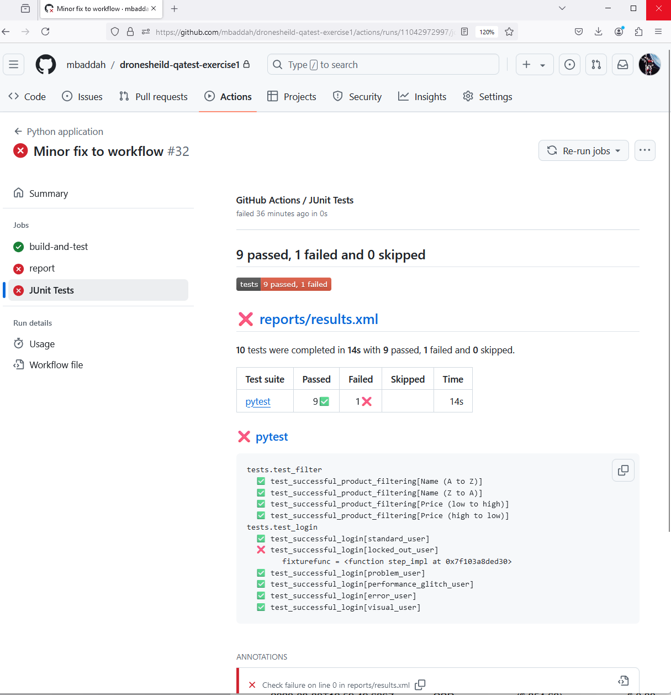

# DECISIONS AND REASONS

The following points outline the decisions I made and the reasons for them:

- Reason for using Chrome as the default browser is because of its 65% browser dominance (see  https://www.statista.com/statistics/268254/
market-share-of-internet-browsers-worldwide-since-2009/)

- I selected Playwright instead of Selenium due to its many advantages, one of the primary ones is the fact that it does not use a server to translate calls in-between the client and browser but instead talks directly to the browser via API. This has the added advantage of reducing flakiness and improving stability for front-end testing.

- I opted to use Python as the language of choice as the team are currently developing in Python and I'd like the team to contribute to improving the framework and writing tests. I don't want silos between devs and QAs.

- I wanted to embed a BDD framework for traceability between user stories , accetapance criteria and the end to end tests, and so I chose to write the tests and feature files using `pytest-bdd`. This also will help with conversations between QAs, devs, and the business.

I'm outputting the reports in multiple formats for demonstration purposes. I've configured Github Actions to ingest the Junit xml output to neatly display the results.

Bonus:

- I used Github Actions for this exercise as running the tests in the pipeline was relatively easy to setup (single yaml file) and didn't require me setting up a whole application like Jenkins. 

- Docker was used to ensure cross platform compatibility between Windows, MacOS, Linux and ease of deployment into the pipeline and/or cloud.
